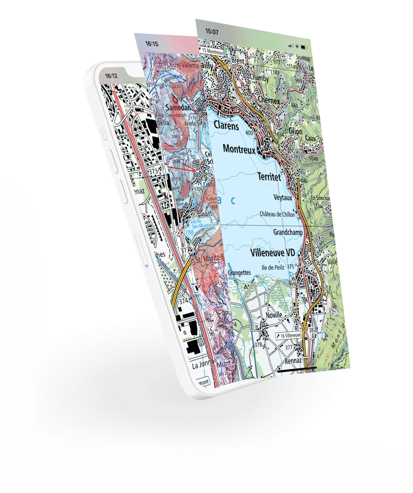

<h1 align="center">Open Swiss Maps SDK</h1> 

 

  
   
   
  Android and iOS SDK to display maps and geodata of swisstopo
   
   

    <!-- SPM -->
    
        <!-- License -->
    
    <!-- iOS Build -->
    
    <!-- android Build -->
    

## Free map layers and geo data by swisstopo in your app
Offer your mobile users the official maps of Switzerland and many other maps and data of swisstopo in your app! Integrate them easily with the "Open Swiss Maps SDK". The data is available for free thanks to Open Government Data (OGD) and can be used freely.
More Information about OGD: <a href="https://www.swisstopo.ch/ogd">www.swisstopo.ch/ogd</a>

  

## Getting started

[Readme Android](./android/)

[Readme iOS](./ios/)

## Features

* Displays swisstopo map layers:
   - Landeskarten (farbig)
   - Landeskarte 1:1 Million | LK1000
   - Landeskarten (grau)
   - Landeskarte Winter | LK10, LK25, LK50, LK100
   - SWISSIMAGE Hintergrund
   - Luftfahrtkarte ICAO
   - Segelflugkarte
   - Sperr- und Gefahrenzonenkarte
   - Dufourkarte Erstausgabe
   - Siegfriedkarte Erstausgabe
   - Eisenbahn swissTLM3D
   - Strassen und Wege swissTLM3D
   - Seilbahnen swissTLM3D
   - Wanderwege
   - Wanderland
   - Veloland Schweiz
   - Mountainbikeland Schweiz
   - Hangneigung ab 30°
   - Hangneigungsklassen ab 30°
   - Wildtierschutzgebiete
   - Wildruhezonen
   - Schneeschuhrouten
   - Skirouten

   - Einschränkungen für Drohnen
* Combine multiple layers on top of each other
* Full mobile map experience with touch & gesture handling
* Update camera to show or animate to different parts of the map
* Add your own polygon layers

...and more to come soon!

## Architecture

To support both the Android and iOS platform, most of the code-base is written in C++ and shared between the two platforms. The Kotlin and Swift interface bindings are generated with a fork of the Djinni library. The library intentionally is designed to have a modular structure, so that most parts of it can be adjusted or completely replaced with custom implementations. Most of the interfaces are also exposed to Swift and Kotlin, so extensions can also conveniently be programmed in those languages.

### OpenMobileMaps

The Open Swiss Maps SDK uses Open Mobile Maps as its core. Open Mobile Maps is a lightweight and modern Map SDK for Android and iOS. More information about this can be found on <a href="https://openmobilemaps.io/">openmobilemaps.io</a> or on [Github](https://github.com/openmobilemaps/maps-core).

## License
This project is licensed under the terms of the MPL 2 license. See the [LICENSE](LICENSE) file.

[Terms of use for free geodata and geoservices (OGD) from swisstopo](https://www.swisstopo.admin.ch/de/home/meta/konditionen/geodaten/ogd.html)

