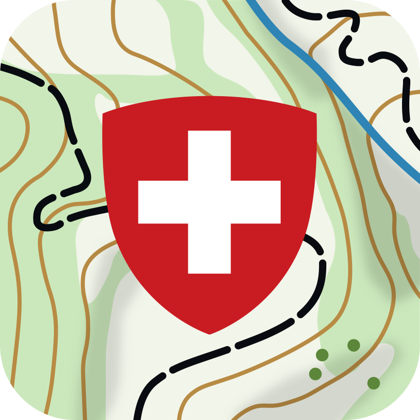

<h1 align="center">Open Swiss Maps SDK</h1>

<br />

<div align="center">
  
<br />
<br />
</div>

<div align="center">
    <!-- SPM -->
    <a href="https://github.com/apple/swift-package-manager">
      
    </a>
    <!-- License -->
    <a href="https://github.com/openmobilemaps/maps-core/blob/master/LICENSE">
      
    </a>
    <!-- iOS Build -->
    <a href="https://github.com/geoadmin/lib-open-swiss-maps-sdk/actions/workflows/ios.yml">
      
    </a>
    <!-- android Build -->
    <a href="https://github.com/geoadmin/lib-open-swiss-maps-sdk/actions/workflows/android.yml">
      
    </a>
</div>


# Android

## How to use

### Add dependency
To add the OpenSwissMaps SDK to your Android project, add the following line to your build.gradle
```
dependencies {
  implementation 'ch.admin.geo.openswissmaps:openswissmaps-sdk:2.0.2'
}
```
Make sure you have mavenCentral() listed in your project repositories. 

### Initializing the library

To use the library, it needs to be initialized as early as possible, e.g. in the oOnCreate(), of the hosting Application by calling:
```kotlin
OpenSwissMaps.initialize()
```

### Display a Swisstopo Map

The SDK provides the `SwisstopoMapView` for configuring and displaying maps.  To use it, simply include it in a layout and register it to the lifecycle of the activity or fragment that contains the view. This is necessary for the execution of map internal tasks such as tile-loading.

```Kotlin
val mapView = findViewById<SwisstopoMapView>(R.id.map_view)
mapView.registerLifecycle(lifecycle)
```

##### Changing the default layer type

The map contains a base-layer that displays the `ch.swisstopo.pixelkarte-farbe` layer by default. The base-layer's type can be changed (or removed by passing `null`) at any time. For example with:

```Kotlin
mapView.setBaseLayerType(SwisstopoLayerType.SWISSIMAGE)
```

##### Adding multiple Swisstopo layers

New layers can easily be created on either the `SwisstopoMapView` directly or be added to it after using the `SwisstopoLayerFactory`. Their transparency value can be adjusted by calling `setAlpha` on the layer object.

```Kotlin
val layer = mapView.addSwisstopoLayer(SwisstopoLayerType.DROHNEN)
```

 ```Kotlin
val layer = SwisstopoLayerFactory.createSwisstopoTiledRasterLayer(SwisstopoLayerType.DROHNEN, mapView.textureLoader)
layer.setAlpha(0.5)
mapView.addLayer(layer.asLayerInterface())
 ```

 See [available layers](../AVAILABLE_LAYERS.md) for a list of all supported layers.

##### Additional Swisstopo Layer Types

There are numerous additional layer types available via the Swisstopo wmts service. They can be added similarly to the predefined `SwisstopoLayerTypes`.

```Kotlin
val layer = mapView.addSwisstopoLayer("ch.bafu.neophyten-haargurke")
```

or via:

```Kotlin
val layer = mapView.swisstopoWmtsResource.createLayer("ch.bafu.neophyten-haargurke", mapView.loaders)
mapView.addLayer(layer.asLayerInterface())
```

Browse the [Geocatalog](https://map.geo.admin.ch) to find available data.

##### Adjusting the Camera

The camera position can easily be adjusted by manipulating the `Camera2dInterface` received from the map. E.g. to set it to a custom location:

```Kotlin
mapView.getCamera()
	.moveToCenterPositionZoom(Coord(CoordinateSystemIdentifiers.EPSG4326(), 8.543912536386152, 47.37623511643675, 0.0), 
	3000.0,
	true)
```

Please note, that the MapView must be ready and running to be able to properly compute the requested view bounds. To this end, it provides the `mapViewState` StateFlow that communicates its current `MapViewState`.

One can also change the default values for the camera's bounds and it's zoom range:

```kotlin
mapView.getCamera().setBounds(RectCoord(Coord(CoordinateSystemIdentifiers.EPSG2056(), 2485071.58, 1299941.79, 0.0), Coord(CoordinateSystemIdentifiers.EPSG2056(), 2828515.82, 1075346.31, 0.0)))
mapView.getCamera().setMinZoom(5000000.0)
mapView.getCamera().setMaxZoom(250.0)
```

##### Reacting to layer clicks

To react to user interaction with a layer, a callback handler can be set. E.g. on the baseLayer in the map (or any other tiled raster layer)

```kotlin
mapView.baseLayer?.setCallbackHandler(object : Tiled2dMapRasterLayerCallbackInterface() {
   override fun onClickConfirmed(coord: Coord): Boolean {
      // Return true, if the click has been consumed here
      return true
   }

   override fun onLongPress(coord: Coord): Boolean {
      // Return true, if the long press has been consumed here
      return true
   }
})
```

Please note that other layer types expose different functionalities in their callback handlers. The polygon layer, for example, returns the polygon hit by the click.

#### Adding a gps layer

A gps layer can conveniently be added to the `SwisstopoMapView` by calling:
```kotlin
mapView.addGpsLayer(lifecycle)
```

##### Style

The layer can be visually customized at creation time by also supplying a `GpsStyleInfo`:
```kotlin
val gpsStyleInfo = GpsStyleInfoFactory.createGpsStyle(
    gpsPointIdicator, // Drawable or Bitmap. Rendered at the currently provided location
    gpsDirectionIndicator, // Drawable or Bitmap. Rendered below the point indicator, indicating the device orientation
    Color(1.0f, 0f, 0f, 0.2f) // Color used to render the accuracy range of the currently provided location
)
mapView.addGpsLayer(lifecycle, style = gpsStyleInfo)
```

##### Location providers

The location updates delivered to the gps layer can either be supplied via one of two default location providers or a custom implementation
of the interface `LocationProviderInterface`. The two available default providers are:

**GPS_ONLY**: A provider that registers to location updates of the devices gps module only.

**GOOGLE_FUSED**: Uses the [FusedLocationProviderClient](https://developers.google.com/android/reference/com/google/android/gms/location/FusedLocationProviderClient.html) of the Google Play Services

When none is supplied to the `GpsLayer` constructor, `GpsProviderType.GPS_ONLY` is used.

```kotlin
mapView.addGpsLayer(lifecycle, providerType = GpsProviderType.GOOGLE_FUSED) // using the FusedLocationProvicerClient
mapView.addGpsLayer(lifecycle, locationProvider = CustomLocationProvider(...)) // using a custom LocationProviderInterface implementation
```

**Be aware that currently you must handle the location permissions of the app yourself!**

##### Modes and Heading

The `GpsLayer` has four different modes to react to location updates:

**DISABLED**: No gps indicator is rendered on the map.

**STANDARD**: The indicator is drawn  at the current location, along with the current heading (if enabled and a texture is provided)

**FOLLOW**: In addition to the same behavior as `STANDARD`, upon a location update, the camera is animated to keep the indicators position centered in the map.

**FOLLOW_AND_TURN**: While following the indicators location updates (as in `FOLLOW`), the camera is rotated to have the map oriented in the direction of the current heading.

Listening to and rendering the devices current orientation can be enabled or disabled by calling:
```kotlin
gpsLayer.setHeadingEnabled(enabled)
```

## How to build
[Installation & Build Instructions](docs/install_readme.md)

## License

This project is licensed under the terms of the MPL 2 license. See the [LICENSE](../LICENSE) file.
